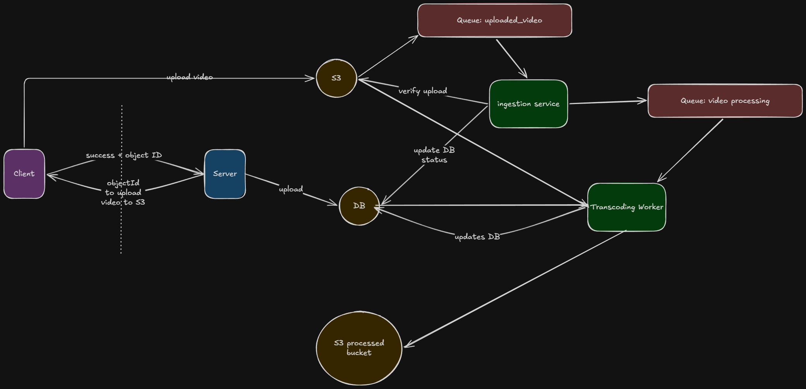
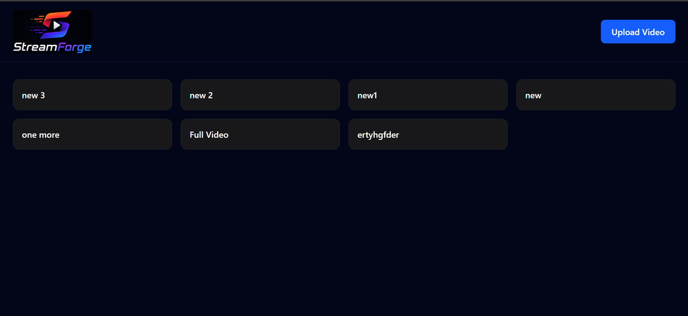
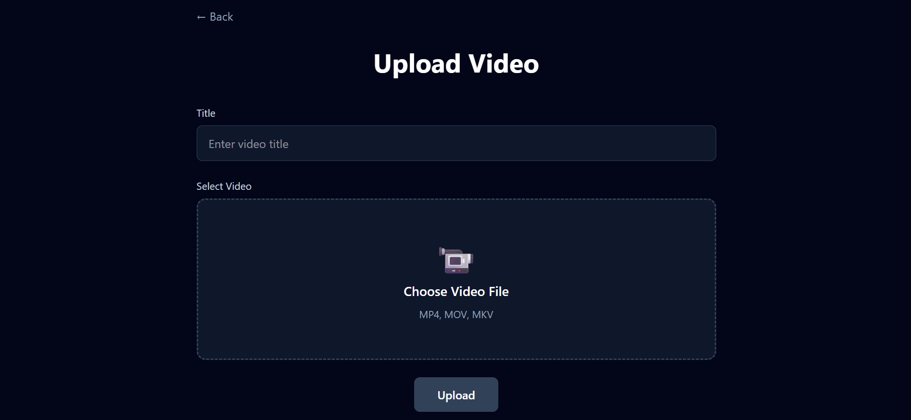

# StreamForge 🎥

StreamForge is a full-stack adaptive video streaming platform inspired by modern streaming services such as YouTube and Netflix.

Users can upload videos, which are automatically processed into multiple resolutions and streamed using HTTP Live Streaming (HLS). The platform dynamically adjusts video quality based on the viewer's network conditions to provide a smooth playback experience.

---

## Features

### Video Upload Pipeline

* Upload videos directly to Amazon S3 using pre-signed URLs
* Secure uploads without routing large files through the backend
* Automatic ingestion workflow triggered via S3 events

### Distributed Processing Architecture

* S3 Event Notifications
* Amazon SQS-based processing pipeline
* Separate ingestion and transcoding workers
* Asynchronous video processing

### Adaptive Streaming

* HLS (HTTP Live Streaming) support
* Multiple quality variants:

  * 360p
  * 480p
  * 720p
  * 1080p
* Automatic bitrate adaptation based on network conditions

### Video Transcoding

* FFmpeg-powered transcoding
* HLS playlist generation
* Segment creation (.ts files)
* Master playlist generation

### Playback

* HLS.js based player
* Adaptive quality switching
* Smooth streaming experience
* Responsive video player interface

### Frontend

* React
* Vite
* Tailwind CSS
* React Router
* Axios

### Backend

* Node.js
* Express.js
* MongoDB Atlas
* AWS SDK

### Cloud Services

* Amazon EC2
* Amazon S3
* Amazon SQS
* MongoDB Atlas

---

## System Design




## Video Processing Flow

1. User uploads a video.
2. Backend generates a pre-signed S3 upload URL.
3. Frontend uploads the video directly to S3.
4. S3 emits an upload event.
5. Event is pushed to SQS.
6. Ingestion Worker consumes the event.
7. Video metadata is updated in MongoDB.
8. Processing job is sent to the processing queue.
9. Transcoding Worker downloads the raw video.
10. FFmpeg generates:

    * 360p stream
    * 480p stream
    * 720p stream
    * 1080p stream
11. HLS playlists are generated.
12. Processed files are uploaded back to S3.
13. Video status is updated to READY.
14. Users can stream the video adaptively.

---

## Running StreamForge Locally

### Prerequisites

Before running the project locally, ensure the following tools are installed:

* Node.js (v22+ recommended)
* npm
* Git
* FFmpeg
* MongoDB Atlas account
* AWS Account

Required AWS Services:

* S3 Bucket (Raw Videos)
* S3 Bucket (Processed Videos)
* SQS Upload Events Queue
* SQS Video Processing Queue

Verify FFmpeg installation:

```bash
ffmpeg -version
```

---

## 1. Clone the Repository

```bash
git clone <repository-url>
cd streamforge
```

---

## 2. Backend Setup

Navigate to backend:

```bash
cd backend
```

Install dependencies:

```bash
npm install
```

Create a `.env` file:

```env
PORT=3000

MONGODB_URI=<your-mongodb-uri>

AWS_REGION=<aws-region>

AWS_ACCESS_KEY_ID=<access-key>
AWS_SECRET_ACCESS_KEY=<secret-key>

RAW_BUCKET=<raw-video-bucket>

PROCESSED_BUCKET=<processed-video-bucket>

SQS_UPLOAD_QUEUE_URL=<upload-queue-url>

SQS_PROCESSING_QUEUE_URL=<processing-queue-url>
```

Start the backend server:

```bash
npm run dev
```

---

## 3. Frontend Setup

Open another terminal:

```bash
cd frontend
```

Install dependencies:

```bash
npm install
```

Create `.env`:

```env
VITE_API_URL=http://localhost:3000
```

Start frontend:

```bash
npm run dev
```

Frontend will be available at:

```text
http://localhost:5173
```

---

## 4. Configure AWS Event Flow

### Upload Queue

Create an SQS queue and configure S3 Event Notifications:

```text
Raw Videos Bucket
    ↓
ObjectCreated
    ↓
Upload Events Queue
```

### Processing Queue

Used internally by the ingestion worker:

```text
Ingestion Worker
    ↓
Processing Queue
    ↓
Transcoding Worker
```

---

## Author

**Himanshu Parashar**

Built as a learning-focused distributed systems and video streaming project to explore modern media processing pipelines and cloud-native architecture.

---

## Project Snapshots



